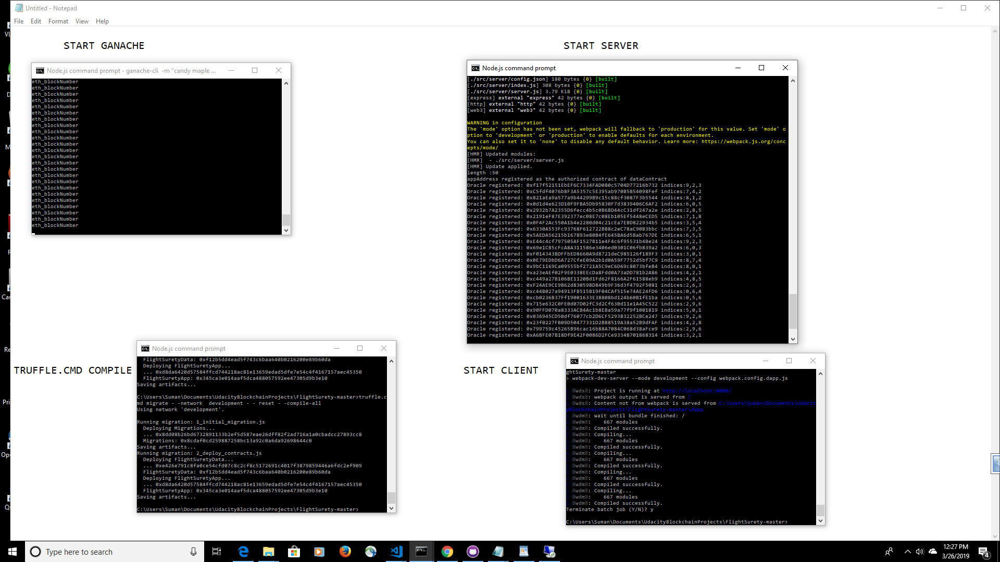
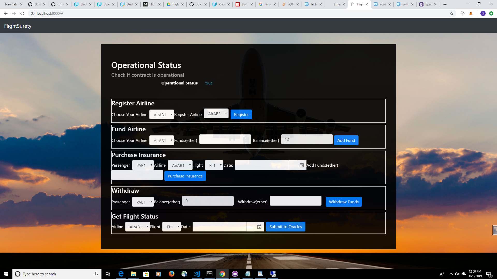

# FlightSurety

FlightSurety is a sample application project for Udacity's Blockchain course.
This repository containts an Ethereum DApp that interacts with the smart contract and Oracles that demonstrates a Airline registration and insurance payout to passengers in case pf airline delay. First airline is registered when contract is deployed.Only existing airline may register a new airline until there are at least four airlines registered. Registration of fifth and subsequent airlines requires multi-party consensus of 50% of registered airlines. Airline can be registered, but does not participate in contract until it submits funding of 10 ether.Passengers may pay up to 1 ether for purchasing flight insurance.If flight is delayed due to airline fault, passenger receives credit of 1.5X the amount they paid. Insurance payouts are not sent directly to passenger’s wallet.Passenger can withdraw any funds owed to them as a result of receiving credit for insurance payout.
Oracle functionality is implemented in the server app.Upon startup, 20+ oracles are registered and their assigned indexes are persisted in memory.Update flight status requests from client Dapp result in OracleRequest event emitted by Smart Contract that is captured by server.Server will loop through all registered oracles, identify those oracles for which the OracleRequest event applies, and respond by calling into FlightSuretyApp contract with random status code of Unknown (0), On Time (10) or Late Airline (20), Late Weather (30), Late Technical (40), or Late Other (50)

The DApp User Interface when running should look like...

Sequence of Operations:
1. First Fund airline . 
2. Register another airline.
3. Purchase insurance
4. Get Flight Status - This will cause the Oracle to always send a staus code of Late Airline so that we can test the payment to the insurees functionality without having to go through lot of simulations.
    Also since I am getting an error(Error: The current provider doesn't support subscriptions: HttpProvider
    at Subscription.subscribe (subscription.js:206)) on trying to watch the FlightStatusInfo event in the browser, the fund deposited in passenger's account will be shown in onchange evnt of the passenger dropdown or app refresh. On googling this error is most probably related to Truffle 5.x. https://github.com/trufflesuite/truffle/issues/1633
5. Withdraw Funds

## Install

This repository contains Smart Contract code in Solidity (using Truffle), tests (also using Truffle), dApp scaffolding (using HTML, CSS and JS) and server app scaffolding.

To install, download or clone the repo, then:

`npm install`

1. Start Ganache like below which will generate 50 accounts that will be used for registering oracles, passengers and airlines.

`ganache-cli -m 'candy maple cake sugar ...' -a 50`

2. Then compile and deploy with truffle.

`truffle.cmd migrate --network development --reset --compile-all`

## Develop Server

`npm run server`

## Develop Client - use Dapp
`npm run dapp`

To run truffle tests:

`truffle test ./test/flightSurety.js`
`truffle test ./test/oracles.js`

To view dapp:

`http://localhost:8000`

## Deploy

To build dapp for prod:
`npm run dapp:prod`

Deploy the contents of the ./dapp folder

## Resources

* [How does Ethereum work anyway?](https://medium.com/@preethikasireddy/how-does-ethereum-work-anyway-22d1df506369)
* [BIP39 Mnemonic Generator](https://iancoleman.io/bip39/)
* [Truffle Framework](http://truffleframework.com/)
* [Ganache Local Blockchain](http://truffleframework.com/ganache/)
* [Remix Solidity IDE](https://remix.ethereum.org/)
* [Solidity Language Reference](http://solidity.readthedocs.io/en/v0.4.24/)
* [Ethereum Blockchain Explorer](https://etherscan.io/)
* [Web3Js Reference](https://github.com/ethereum/wiki/wiki/JavaScript-API)